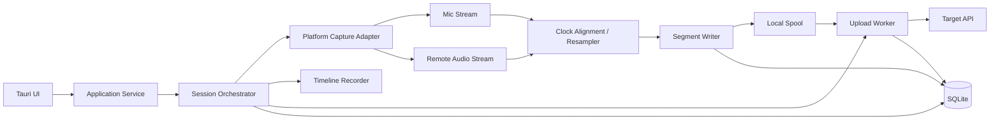
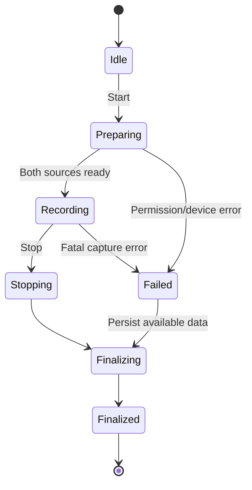
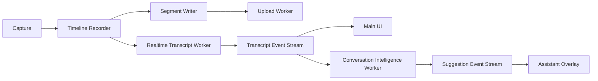

# デスクトップ2トラック会議レコーダー Phase 1 設計書

* **文書ステータス**: Draft v0.1
* **作成日**: 2026-07-07
* **対象**: Windows / macOS / Linux
* **目的**: 別のビデオ会議アプリを利用しながら、利用者のマイク音声と会議アプリの再生音声を別トラックで録音し、所定のAPIへ確実にアップロードする

---

## 1. 概要

Phase 1では、デスクトップ上で動作する録音アプリを提供する。

利用者はZoom、Microsoft Teams、Google Meetなどの既存会議アプリを通常どおり利用し、本アプリから次の2つの音声源を選択して録音する。

1. **Self track**: 利用者のマイク入力
2. **Remote track**: 会議アプリから再生される相手側音声

録音データは一定時間ごとのチャンクとしてローカルへ安全に保存し、ネットワーク状況に応じて所定のAPIへ再送可能な形でアップロードする。

「2channel」は、単にステレオの左右へその場でミックスすることではなく、**共通タイムライン上に整列した2本の独立した論理トラック**として扱う。必要な場合のみ、最終出力時に次の形式へ変換する。

* Left: Self
* Right: Remote

---

## 2. 背景と設計上の核心

マイクと会議アプリ音声は、異なるOS API、異なるデバイスクロック、異なるバッファ周期で届く。

そのため、単純に2つの録音ストリームを開始してファイルへ書き込むだけでは、次の問題が起きる。

* 長時間録音で少しずつ同期がずれる
* 一方のデバイス切断時にトラック長が不一致になる
* スリープ復帰やデバイス変更で時間が飛ぶ
* アプリクラッシュ時に録音全体を失う
* アップロード失敗時に録音済みデータまで失う

本設計では、以下を中心原則とする。

> Captureは音声サンプルを取得する責務だけを持ち、Recorderが共通タイムラインへの整列、欠損補完、チャンク確定、永続化を担う。

---

## 3. Phase 1のゴール

### 3.1 機能ゴール

* Windows、macOS、Linuxで動作するデスクトップアプリ
* マイクデバイスを選択できる
* 会議アプリまたは再生音声源を選択できる
* Self / Remoteを別トラックで録音できる
* 録音中に両トラックのレベルを確認できる
* 録音を開始、停止できる
* 録音中からチャンク単位でアップロードできる
* ネットワーク断後に自動再送できる
* アプリ再起動後に未送信データを復旧できる
* API側で重複登録されない
* 録音履歴とアップロード状態を確認できる
* 録音中であることを常時明示する

### 3.2 品質ゴール

* 2時間録音後のSelf / Remote同期差: 100ms以内
* 通常動作時の音声欠損: 連続50ms未満を目標
* クラッシュ時の最大未確定損失: 30秒以内
* 再送による重複セグメント登録: 0件
* UIを閉じても、明示的に停止しない限り録音を継続
* 途中までアップロード済みのセッションを再開可能

---

## 4. Phase 1の非目標

以下はPhase 1では実装しない。

* iPhone / Android対応
* 会議URLからの自動参加
* Zoom / Meet / Teamsの会議API連携
* カレンダー連携
* 発言者識別
* 自動文字起こし
* リアルタイム文字起こし
* 会議中のAIサジェスト
* 透明オーバーレイによる会話支援UI
* Chrome拡張によるブラウザタブ音声取得
* Apple Watch / Pixel Watchなどのスマートウォッチ対応
* 録音開始の完全自動化
* 音声内容による会議判定
* ノイズ抑制、AGC、音響エコーキャンセル
* 画面録画、カメラ録画
* 会議アプリのチャット取得
* 仮想オーディオデバイスやカーネルドライバの配布
* 同一PC上で動作する任意アプリ音声の完全分離保証
* ブラウザ内の特定タブだけを全OSで正確に取得する保証

---

## 5. 対応プラットフォーム

### 5.1 Windows

**対象**: Windows 11

使用API:

* マイク: WASAPI capture
* 会議音声: Application Loopback Capture
* フォールバック: Endpoint Loopback Capture

Windowsの通常のWASAPI loopbackでは、選択した再生エンドポイントで再生されるシステムミックスを取得できる。Application Loopback Captureでは、指定したプロセスとその子プロセスだけを対象にした取得、またはそのプロセスツリーを除外した取得が可能である。Microsoftの公式サンプルはWindows 10 build 20348以降を要件としているため、Windows 11を対象とすれば要件を満たす。

#### Windowsの選択方針

1. 会議アプリのプロセスツリーを選択できる場合

   * Application Loopback Captureを使用
2. 対象プロセスを特定できない場合

   * 出力デバイスのEndpoint Loopbackを使用
3. ブラウザ会議の場合

   * ブラウザのマルチプロセス構造により、他タブの音声が含まれる可能性をUIで表示

#### 制約

* 会議アプリの再起動でPIDが変わる
* ブラウザでは対象タブだけに限定できない場合がある
* Bluetoothの通話プロファイル切替でサンプルレートや音質が変わる
* 排他モードや特殊ドライバでは取得できない可能性がある

### 5.2 macOS

**対象**: macOS 15以降

使用API:

* 会議音声: ScreenCaptureKit `SCStreamOutputType.audio`
* マイク: ScreenCaptureKit `SCStreamOutputType.microphone`
* 対象アプリ指定: `SCContentFilter`

ScreenCaptureKitは、選択した画面・アプリ・ウィンドウに関連する映像とシステム音声を取得できる。WWDC24でマイク出力が追加され、system audioとmicrophoneを別出力として同一ストリームから受け取れるため、macOS 15以降をPhase 1の正式対象とする。

必要な権限:

* Microphone
* Screen & System Audio Recording

macOSでは、マイクと画面・システムオーディオ録音について、それぞれPrivacy & Securityから許可する必要がある。

#### macOSの選択方針

1. 実行中アプリ一覧から会議アプリを選択
2. ScreenCaptureKitのアプリフィルタを作成
3. 同一のSCStreamからsystem audioとmicrophoneを取得
4. 共通のホスト時刻へ変換してRecorderへ渡す

#### 制約

* 初回起動時にOS権限付与が必要
* 権限拒否・取消時は録音できない
* ブラウザの場合、ブラウザ全体の音声が対象になる可能性がある
* OSアップデートによるScreenCaptureKit挙動差を継続検証する必要がある

### 5.3 Linux

**正式対象**: PipeWire環境

推奨検証環境:

* Ubuntu 24.04以降
* Fedora Workstation
* Wayland / PipeWire

使用API:

* マイク: PipeWire capture source
* 会議音声: 対象アプリのplayback node、またはsink monitor
* ノード管理: PipeWire registry / session manager

PipeWireは音声・映像・MIDIを扱うグラフ型フレームワークであり、キャプチャストリームやsink monitorをノード・ポートとして扱える。`stream.capture.sink`を利用してsink出力を取得する仕組みも提供されている。

#### Linuxの選択方針

1. PipeWireのsource、sink、playback streamを列挙
2. 利用者が会議アプリのplayback streamを選択
3. 対象ストリームを直接取得できない場合はsink monitorへフォールバック
4. ノード消失・再生成を監視し、再接続する

#### 制約

* ディストリビューション、PipeWire、WirePlumberの差異
* Flatpak / Snapによる権限制限
* ブラウザやElectronアプリのストリーム名が安定しない場合がある
* PulseAudioネイティブ環境はPhase 1では正式対象外

---

## 6. 技術スタック

### 6.1 推奨構成

* **UIシェル**: Tauri 2
* **フロントエンド**: TypeScript + Vue 3
* **共通コア**: Rust
* **非同期ランタイム**: Tokio
* **メタデータDB**: SQLite
* **音声エンコード**: Opus
* **HTTPクライアント**: Rust側
* **macOSネイティブブリッジ**: Swift + C ABI
* **WindowsネイティブAPI**: Rust `windows` crate、必要箇所のみC++サンプルを参照
* **LinuxネイティブAPI**: PipeWire Rust bindingsまたは最小C FFI

TauriはWindows、macOS、Linuxを対象にでき、RustコアとWebフロントエンドを組み合わせられる。ウィンドウやシステムトレイをクロスプラットフォームで扱えるため、今回の常駐型デスクトップアプリに適している。

音声処理、録音状態、アップロード状態はフロントエンドへ置かず、Rust側をSingle Source of Truthとする。

OS差分の本番吸収境界は、別プロセスのCLIではなく`CaptureAdapter` traitとOS別crateに置く。CLIは診断、スパイク、手動テスト、自動テスト用の薄い入口として、同じ`app-service` / `capture-api`を呼び出す。

### 6.2 Tauriを採用する理由

* Windows / macOS / Linuxを同一UIコードで扱える
* Rustコアをそのまま利用できる
* システムトレイ常駐を実装しやすい
* UIの再描画やWebViewの状態と録音ライフサイクルを分離できる
* Electronより配布物と常駐メモリを抑えやすい

---

## 7. 全体アーキテクチャ



### 7.1 責務分離

#### Platform Capture Adapter

* デバイス・アプリ音声源の列挙
* OS権限の確認
* キャプチャ開始・停止
* PCMフレームとタイムスタンプの通知
* デバイス消失イベントの通知

以下は行わない。

* ファイル保存
* アップロード
* セッション状態の決定
* サンプル欠損の補完
* 長期的な時計補正

#### Timeline Recorder

* 2ソースを共通タイムラインへ整列
* 48kHz monoへ正規化
* 一定長フレームへ変換
* 欠損区間をsilenceとして補完
* クロックドリフトを補正
* セグメント境界を統一
* エンコーダへ渡す

#### Segment Writer

* Self / Remoteを同じ開始時刻・同じ長さで確定
* 一時ファイルへ書き込み
* fsync
* ハッシュ計算
* atomic rename
* SQLiteへ確定記録

#### Upload Worker

* セッション作成
* セグメントの送信
* 再試行
* 重複防止
* 完了通知
* 送信済みデータの削除判定

---

## 8. コンポーネント構成

```text
meeting-recorder/
├─ apps/
│  └─ desktop/
│     ├─ src/                    # Vue UI
│     └─ src-tauri/              # Tauri shell
├─ tools/
│  └─ recorderctl/               # 診断・スパイク用CLI
├─ crates/
│  ├─ recorder-domain/           # 型、状態、イベント
│  ├─ capture-api/               # CaptureAdapter trait
│  ├─ capture-windows/           # WASAPI
│  ├─ capture-linux/             # PipeWire
│  ├─ audio-timeline/            # 整列、再サンプリング、欠損補完
│  ├─ segment-store/             # チャンク永続化
│  ├─ upload-client/             # API adapter、retry
│  ├─ session-store/             # SQLite
│  └─ app-service/               # Use case orchestration
├─ native/
│  └─ macos-capture/             # Swift / ScreenCaptureKit
└─ docs/
   └─ phase1-design.md
```

`recorderctl`は本番録音エンジンを別プロセス化するためのものではない。次の用途に限定する。

* デバイス・会議アプリ候補の列挙
* 権限状態の確認
* 5秒から10秒程度のキャプチャテスト
* 診断ログ・capability結果の出力
* スパイクでのOS API挙動確認

---

## 9. ドメインモデル

### 9.1 トラック

```rust
pub enum TrackKind {
    SelfMic,
    RemoteAudio,
}
```

### 9.2 キャプチャフレーム

```rust
pub struct CapturedFrame {
    pub track: TrackKind,
    pub host_time_ns: u64,
    pub source_time_ns: Option<u64>,
    pub sample_rate: u32,
    pub channels: u16,
    pub samples: Vec<f32>,
    pub discontinuity: bool,
}
```

`host_time_ns`は、OSの単調増加クロックへ変換した値とする。壁時計時刻を同期処理へ直接使用しない。

### 9.3 セグメント

```rust
pub struct AudioSegment {
    pub session_id: SessionId,
    pub track: TrackKind,
    pub sequence: u64,
    pub timeline_start_ms: u64,
    pub duration_ms: u32,
    pub codec: AudioCodec,
    pub sample_rate: u32,
    pub channels: u16,
    pub sha256: String,
    pub local_path: PathBuf,
    pub byte_len: u64,
}
```

### 9.4 セッションマニフェスト

```json
{
  "schema_version": 1,
  "session_id": "01J...",
  "started_at": "2026-07-07T00:00:00Z",
  "ended_at": null,
  "platform": "windows",
  "app_version": "0.1.0",
  "capture": {
    "microphone_device_id": "...",
    "remote_source_id": "...",
    "remote_source_kind": "application_process"
  },
  "audio": {
    "sample_rate": 48000,
    "segment_duration_ms": 30000,
    "tracks": ["self", "remote"]
  },
  "consent": {
    "confirmed_by_user": true,
    "confirmed_at": "2026-07-07T00:00:00Z"
  }
}
```

---

## 10. セッション状態モデル

録音状態とアップロード状態は分離する。

```rust
pub enum CaptureState {
    Idle,
    Preparing,
    Recording,
    Stopping,
    Finalizing,
    Finalized,
    Failed { recoverable: bool, reason: String },
}

pub enum UploadState {
    NotStarted,
    Pending,
    Uploading,
    WaitingForNetwork,
    Paused,
    Completed,
    Failed { retryable: bool, reason: String },
}
```

これにより、録音に失敗しても確定済みセグメントをアップロードできる。逆に、アップロードに失敗しても録音は継続できる。



---

## 11. 音声タイムライン設計

### 11.1 正規化形式

内部処理形式:

* sample rate: 48kHz
* channels: mono per track
* sample type: float32
* processing frame: 20ms
* persisted codec: Opus
* segment duration: 30秒

Remoteがステレオの場合は、Phase 1ではmonoへダウンミックスする。

### 11.2 共通タイムライン

録音開始時に単調時刻`T0`を決定する。

各キャプチャフレームは次の位置へ配置する。

```text
timeline_offset = frame.host_time - T0
```

2つのソースが異なる周期で到着しても、同じ20msスロットへ配置する。

### 11.3 欠損処理

次の場合は欠損イベントを記録し、対象トラックへsilenceを挿入する。

* デバイス切断
* OSコールバック停止
* アプリ音声ストリーム消失
* バッファオーバーラン
* スリープ・復帰
* OSがdiscontinuityを報告

Self / Remoteのファイル長は常に一致させる。

### 11.4 クロックドリフト

マイクデバイスと再生側のクロックは、長時間でずれる可能性がある。

Recorderは、期待サンプル位置と実サンプル位置の差分を監視する。

* 小さい差: resampler比率を緩やかに調整
* 大きい不連続: silence挿入または超過サンプル破棄
* すべての補正をsession eventへ記録

急激な補正で音声を歪ませない。補正比率には上限を設ける。

---

## 12. 永続化設計

### 12.1 ローカルスプール

```text
app-data/
└─ sessions/
   └─ {session_id}/
      ├─ manifest.json
      ├─ session.db-journal
      ├─ self/
      │  ├─ 000000.opus
      │  └─ 000001.opus
      ├─ remote/
      │  ├─ 000000.opus
      │  └─ 000001.opus
      └─ events.jsonl
```

### 12.2 セグメント確定手順

1. `{sequence}.partial`へ書く
2. encoderをflushする
3. fsyncする
4. SHA-256を計算する
5. `{sequence}.opus`へatomic renameする
6. SQLiteへ`ready`として登録する
7. Upload Workerへ通知する

DB登録前にクラッシュした場合は、再起動時スキャンで孤立ファイルを検査する。

この手順を一般化した「Effect完了保証・冪等性・reconciliation」の設計(chunk方式でのバッチ確定、WAVの遅延生成、失敗分類、保証レベルの定義)は [audio-device-state-architecture.md](audio-device-state-architecture.md) §7 を参照。

### 12.3 保持ポリシー

* 未送信データは削除しない
* API側の受領確認後に`uploaded`へ変更
* セッション完了確認後、設定された保持期間を経て削除
* 初期値は7日
* 利用者が明示的に即時削除できる

### 12.4 機密情報

* APIトークンを平文設定ファイルへ保存しない
* Windows Credential Manager / DPAPI
* macOS Keychain
* Linux Secret Service
* 通信はTLS必須
* ローカル音声ファイル暗号化は外部ベータ前の必須ハードニング項目とする

---

## 13. アップロードAPI境界

実際の所定API仕様に依存させないため、`UploadAdapter`を定義する。

```rust
#[async_trait]
pub trait UploadAdapter: Send + Sync {
    async fn create_session(
        &self,
        manifest: &SessionManifest,
    ) -> Result<RemoteSession, UploadError>;

    async fn upload_segment(
        &self,
        remote: &RemoteSession,
        segment: &AudioSegment,
    ) -> Result<UploadReceipt, UploadError>;

    async fn finalize_session(
        &self,
        remote: &RemoteSession,
        summary: &SessionSummary,
    ) -> Result<(), UploadError>;
}
```

### 13.1 推奨API契約

```text
POST /v1/recording-sessions
PUT  /v1/recording-sessions/{id}/tracks/{track}/segments/{sequence}
POST /v1/recording-sessions/{id}/finalize
GET  /v1/recording-sessions/{id}
```

### 13.2 必須ヘッダー

```text
Authorization: Bearer ...
Idempotency-Key: {session_id}:{track}:{sequence}
Content-SHA256: ...
Content-Type: audio/ogg; codecs=opus
```

### 13.3 再送規則

* timeout、5xx、429は再送
* 401はトークン更新後に1回再送
* 400系の恒久エラーは停止
* exponential backoff + jitter
* APIが受領済みの場合は成功扱い
* セグメント順序とアップロード順序は一致しなくてもよい
* finalizeは全セグメント受領後のみ実行

### 13.4 アップロード方針

Phase 1では、録音中から30秒セグメント単位で随時アップロードする。録音完了後にまとめてアップロードする方式は、実装は単純だが、長時間会議後の失敗影響が大きく、将来のリアルタイム文字起こしにも接続しにくいため主方式にしない。

録音の正本は常にローカルスプールに置く。Upload Workerはスプール済みセグメントを非同期に送信し、ネットワーク断やAPI障害時も録音をブロックしない。

将来のリアルタイム文字起こしでは、録音保存用の30秒セグメントとは別に、1秒から5秒程度の短チャンクまたはストリーミング経路を追加する。文字起こし経路の失敗は録音継続に影響させず、保存済みセグメントから後処理で再文字起こしできるようにする。

---

## 14. UI設計

### 14.1 初期画面

表示項目:

* マイク選択
* 会議音声ソース選択
* Selfレベルメーター
* Remoteレベルメーター
* 録音同意確認
* 録音開始ボタン
* 権限状態
* API接続状態

### 14.2 録音中画面

表示項目:

* 録音時間
* 赤い録音インジケータ
* Self / Remoteレベル
* 音声欠損警告
* アップロード済み時間
* ローカル未送信容量
* 停止ボタン

### 14.3 履歴画面

* 開始日時
* 録音時間
* 完了 / 未送信 / 失敗
* 再送ボタン
* ローカルデータ削除
* 診断ログ出力

### 14.4 権限エラー

単に「権限がありません」と表示せず、OSごとの設定画面へ誘導する。

例:

* macOS: Microphone、Screen & System Audio Recording
* Windows: Microphone privacy
* Linux: PipeWire接続、Flatpak portal

---

## 15. 音声源選択UX

### 15.1 推奨ソース

アプリは既知の会議アプリを優先表示する。

* Zoom
* Microsoft Teams
* Google Chrome
* Microsoft Edge
* Firefox
* Slack
* Webex

ただし、実行ファイル名だけで「会議中」と断定しない。

### 15.2 テスト機能

録音開始前に5秒のテストを実行できる。

* マイクへ話す
* 相手音声または会議アプリのテスト音を再生
* 2つのレベルが別々に反応することを確認
* Remoteが無音の場合は開始前に警告

### 15.3 ブラウザ警告

ブラウザを選んだ場合:

> ブラウザの構造上、会議以外のタブ音声が含まれる場合があります。不要なタブを閉じるか、会議専用のブラウザウィンドウを利用してください。

---

## 16. デバイス変更と障害処理

### 16.1 マイク切断

* 切断イベントを記録
* Selfへsilenceを挿入
* 同一device IDの復帰を一定時間待つ
* 復帰しない場合は代替デバイスを提示
* 自動切替した場合はUIへ明示

### 16.2 会議アプリ再起動

* Windows: 対象プロセスの再探索
* macOS: running applicationの再探索
* Linux: node再生成の監視
* 復帰まではRemoteへsilenceを挿入

### 16.3 ネットワーク断

* 録音は継続
* UploadStateを`WaitingForNetwork`へ変更
* ローカル容量の閾値を監視
* 空き容量不足前に警告
* 復旧後に古いセグメントから再送

### 16.4 ディスク容量不足

段階的に警告する。

* 2GB未満: warning
* 500MB未満: critical
* 次セグメントを安全に確定できない場合: 録音停止
* 停止前までのデータはfinalizeする

### 16.5 デバイス切替方針

録音中のデバイス選択は、既定では録音開始時に選んだデバイスへ固定する。OSの既定マイクや既定スピーカーが変わっても、無条件には追随しない。

理由:

* 勝手な切替でSelf / Remoteの意味が崩れることを避ける
* Remote trackに会議以外の音声が混入することを避ける
* 後から「どの音声源を録音したか」を説明可能にする

デバイスbinding mode:

```text
Fixed selected device       デフォルト。選択デバイスを継続する
Follow system default       明示設定時のみ。OS既定デバイスへ追随する
Ask before switching        既定変更や無音検出時にユーザーへ確認する
```

選択デバイスが切断された場合は、対象トラックへsilenceを挿入し、同じdevice IDの復帰を待つ。復帰しない場合は代替デバイスを提示する。切替が発生した場合は、`device_switch`イベントとして記録する。

Phase 1では、Fixed selected deviceを既定とし、Follow system defaultは詳細設定または実験的設定に留める。

上記の運用方針を実装するアーキテクチャ(endpoint観測・選択ポリシー・録音bindingのFSM分離、Observation/Admission/Decision/Effect Executionの層分け、Replay設計)は [audio-device-state-architecture.md](audio-device-state-architecture.md) を参照。

---

## 17. 可観測性と診断

### 17.1 記録するメトリクス

* capture callback間隔
* ring buffer使用率
* dropped frame数
* inserted silence時間
* resample correction量
* セグメントencode時間
* セグメントサイズ
* upload throughput
* retry回数
* source reconnect回数

### 17.2 ログ方針

音声内容や認証トークンはログへ出さない。

ログに含めるもの:

* session_id
* platform
* app version
* device IDのハッシュ
* state transition
* OS error code
* segment sequence
* timing statistics

### 17.3 診断パッケージ

ユーザーが任意で出力できるZIP:

* sanitized log
* manifest
* device一覧
* capture capability結果
* 音声ファイルは含めない

---

## 18. セキュリティとプライバシー

### 18.1 原則

* 隠し録音を目的にしない
* 録音中であることをUIとトレイで明示
* 利用者の明示操作で開始
* 同意確認をセッションメタデータに記録
* 最小保持
* 最小権限
* ログに音声内容を残さない

### 18.2 脅威

* APIトークン漏洩
* ローカル音声ファイルの窃取
* 別アプリ音声の意図しない混入
* 再送による重複
* 不正なAPIエンドポイントへのアップロード
* 診断ログへの個人情報混入
* 透明オーバーレイやサジェスト内容が画面共有に映り込む
* AIサジェストが会議内容を過剰に解釈し、不適切な助言を表示する

### 18.3 対策

* OS資格情報ストア
* APIホストの固定または署名済み設定
* TLS
* セグメントハッシュ
* idempotency key
* アップロード完了後の自動削除
* 対象アプリ名を録音画面へ常時表示
* システムミックス利用時は目立つ警告
* 将来のオーバーレイはホットキーで即時非表示にできる
* 画面共有中の自動非表示または警告を検討する
* サジェストは確度の高い短文に限定し、録音・文字起こし結果の正本を書き換えない

---

## 19. テスト戦略

### 19.1 単体テスト

* フレームのタイムライン配置
* silence挿入
* サンプルレート変換
* クロックドリフト補正
* セグメント境界
* ハッシュ計算
* upload retry
* idempotency key生成
* 状態遷移
* クラッシュ復旧スキャン

### 19.2 疑似キャプチャテスト

OS APIなしで2つの疑似音源を生成する。

* Self: 440Hz
* Remote: 880Hz
* 異なるsample rate
* 意図的なclock drift
* packet loss
* discontinuity
* source restart

2時間分を高速実行し、出力トラックの長さと同期を検証する。

### 19.3 実機テスト

#### Windows

* Zoom desktop
* Teams desktop
* Chrome Google Meet
* USBマイク
* Bluetoothヘッドセット
* 出力デバイス切替
* 会議アプリ再起動
* スリープ復帰
* ネットワーク断

#### macOS

* Zoom
* Teams
* Chrome Meet
* 初回権限付与
* 権限拒否
* 権限取消
* AirPods切替
* アプリ再起動
* スリープ復帰

#### Linux

* Ubuntu + PipeWire
* Fedora + PipeWire
* Zoomまたは対応クライアント
* Chrome Meet
* Wayland
* playback node再生成
* sink切替

### 19.4 音声検証

* Selfだけ発音
* Remoteだけ発音
* 同時発音
* 30分 / 2時間
* 無音
* デバイス抜去
* 通知音混入の有無
* 左右変換した最終ファイルの確認

---

## 20. 受け入れ条件

### 20.1 共通

* SelfとRemoteが別トラックで保存される
* 同一sequenceの両トラックが同じ長さ
* 2時間録音で同期差100ms以内
* 30秒ごとに確定ファイルが生成される
* 強制終了後に確定済みデータを復旧できる
* 未送信セグメントを再起動後に送信できる
* 同一セグメントを複数回送信してもAPI上で重複しない
* ネットワーク断中も録音できる
* 録音中表示を隠せない
* APIトークンが平文ファイルへ保存されない

### 20.2 Windows

* 指定したZoomまたはTeamsの音声を取得できる
* マイクと会議音声が別トラックになる
* system loopbackへのフォールバックが動作する

### 20.3 macOS

* ScreenCaptureKitのsystem audioとmicrophoneを取得できる
* 権限不足を正しく検出できる
* 対象アプリ変更を反映できる

### 20.4 Linux

* PipeWire sourceとplayback nodeを選択できる
* node消失を検出できる
* sink monitorフォールバックが動作する

---

## 21. 実装フェーズ

### Phase 1A: Windows縦切り

* Tauriアプリ雛形
* Rustドメイン型
* マイクWASAPI capture
* Endpoint Loopback
* タイムライン整列
* 30秒Opusセグメント
* ローカル保存
* 固定APIへのアップロード
* 最小UI
* 強制終了復旧

**完了条件**: Zoom会議を30分録音し、Self / Remoteを別トラックでAPIへ送信できる。

### Phase 1B: Windows製品化

* Application Loopback
* プロセス選択
* 再送
* SQLite
* 履歴画面
* トレイ常駐
* デバイス変更
* 2時間耐久試験

### Phase 1C: macOS対応

* Swift ScreenCaptureKit bridge
* 権限フロー
* app filter
* microphone output
* notarization / signing
* AirPods・スリープ試験

### Phase 1D: Linux対応

* PipeWire registry
* source / playback node選択
* monitor fallback
* Ubuntu / Fedora packaging
* Wayland試験

### Phase 1E: ハードニング

* ローカル暗号化
* 自動アップデート
* crash report
* API証明書・設定保護
* 長時間負荷試験
* 外部ベータ

---

## 22. 優先順位

### P0

* WindowsでSelf / Remoteの別録音
* 共通タイムライン
* チャンク永続化
* 再起動復旧
* 再送可能アップロード
* 明示的録音表示

### P1

* Application Loopback
* macOS
* Linux
* デバイス再接続
* 履歴・手動再送
* トレイ

### P2

* ローカル暗号化
* 自動会議アプリ候補選択
* 自動録音開始候補通知
* 最終ステレオファイル生成
* 診断パッケージ

### 将来拡張

* 録音後の文字起こし
* 準リアルタイム文字起こし表示
* 会議中の要約・サジェスト
* 透明または半透明オーバーレイ
* デバイス切替復旧用Recovery Buffer
* Chrome拡張によるブラウザ会議特化キャプチャ
* Apple Watch / Pixel Watchを補助マイクとして利用

---

## 23. 主要リスクと判断

| リスク               | 影響           | 対策                          |
| ----------------- | ------------ | --------------------------- |
| ブラウザ会議で他タブ音声が混入   | プライバシー、品質    | 警告、専用ウィンドウ推奨、可能な範囲でstream選択 |
| スピーカー音がマイクへ回り込む   | Selfに相手音声が混入 | ヘッドセット推奨、Phase 2でAEC検討      |
| デバイスクロック差         | 長時間同期ずれ      | 共通タイムライン、drift correction   |
| Bluetoothプロファイル切替 | 音質低下、形式変更    | format change検出、再初期化、イベント記録 |
| OS権限拒否            | 録音不可         | 事前診断、設定導線                   |
| Linux環境差          | サポート負荷       | PipeWire限定、検証済み環境を明示        |
| API障害             | 未送信蓄積        | ローカルスプール、再送、容量警告            |
| アプリクラッシュ          | 録音損失         | 30秒チャンク、atomic commit、復旧    |
| システム音全体を誤取得       | 不要音混入        | app-specific優先、常時ソース表示      |
| 文字起こし経路の遅延・失敗     | リアルタイム表示欠落   | 録音正本とは分離し、保存済み音声から後処理      |
| サジェストの割り込み過多       | 会議体験の悪化      | 確度の高い短文のみ表示、ユーザーが即時非表示可能  |
| オーバーレイの画面共有映り込み   | 機密情報露出       | 共有中非表示、モニター選択、ホットキー非表示     |
| Recovery Bufferの過剰取得 | プライバシー懸念     | 明示的な有効化、対象デバイス限定、短時間保持、永続化しない |
| 誤った復旧音声の採用          | 不要音混入・品質低下   | 自動採用条件を厳格化し、原則ユーザー確認を挟む       |
| Watch単体録音の制約       | 品質・継続性不足     | Phase 1対象外、補助マイク用途に限定       |
| Chrome拡張の取得範囲制約    | 対象外音声の取得不可   | ブラウザタブ会議専用の補助経路として扱う       |

---

## 24. 設計判断のまとめ

1. Phase 1はデスクトップ専用とする。
2. 2channelはSelf / Remoteの独立論理トラックとする。
3. OS固有キャプチャと共通Recorderを分離する。
4. すべての音声を単調時刻ベースの共通タイムラインへ配置する。
5. 30秒ごとにクラッシュセーフなセグメントとして確定する。
6. 録音とアップロードの状態を分離する。
7. アップロードAPIはadapter境界の外側に置く。
8. Windowsから縦切り実装し、その後macOS、Linuxへ展開する。
9. 仮想オーディオドライバはPhase 1では使用しない。
10. 録音は常に可視化し、秘密録音を製品要件にしない。
11. 本番のOS差分吸収は`CaptureAdapter` traitとOS別実装で行い、CLIは診断・検証用入口に留める。
12. リアルタイム文字起こし、要約、サジェスト、透明オーバーレイはPhase 1の外に置き、録音基盤の上に非同期パイプラインとして追加する。
13. Chrome拡張はブラウザ会議に特化した将来の補助キャプチャ経路として扱い、デスクトップ版のOSレベルキャプチャを置き換えない。
14. Apple Watch / Pixel WatchはRemote track取得手段ではなく、将来の補助Self track入力として検討する。
15. デバイス切替復旧は、選択していない音声源を扱うため、明示的なRecovery Buffer機能として説明し、ユーザーが有効化した場合のみ動作させる。

---

## 25. 将来拡張: 文字起こし・会話支援

Phase 1では実装しないが、録音基盤の上にリアルタイム文字起こし、要約、サジェストを追加できる構成を想定する。

### 25.1 基本方針

* 録音・保存・アップロードを最優先の正本経路とする
* 文字起こしとサジェストは録音をブロックしない非同期経路にする
* リアルタイム処理が失敗しても、保存済みセグメントから後処理で復旧できる
* partial transcriptとfinal transcriptを分ける
* AIサジェストは録音内容や文字起こしの正本を書き換えない



### 25.2 文字起こしデータモデル

```rust
pub struct TranscriptChunk {
    pub session_id: SessionId,
    pub track: TrackKind,
    pub start_ms: u64,
    pub end_ms: u64,
    pub text: String,
    pub is_final: bool,
    pub revision: u32,
}
```

Self / Remoteを別トラックで持つため、文字起こしもtrack単位で保持する。表示時に共通タイムライン上で統合し、発話順に並べる。

### 25.3 サジェスト対象

1on1支援では、会議中の提案を次のカテゴリに限定する。

* 深掘り質問
* 話題の抜け漏れ
* 次に聞くとよい確認
* 感情・懸念の検出
* 決定事項とアクションアイテム候補
* 話しすぎ / 聞きすぎのバランス
* 前回1on1との未解決事項

サジェストは短く、確度の高いものだけを表示する。常時チャットのように大量表示せず、会話を邪魔しない設計にする。

### 25.4 透明オーバーレイ

将来の会話支援UIとして、メインウィンドウとは別のAssistant Overlay Windowを検討する。

表示項目:

* 録音中表示
* ライブ要約
* 次に聞くとよい質問
* アクションアイテム候補
* 文字起こしの短い抜粋

オーバーレイ要件:

* 半透明または透明ウィンドウ
* always-on-top
* decorationsなし
* 右端固定または選択モニター固定
* ホットキーで即時表示/非表示
* 画面共有中の自動非表示または警告

完全な透明フローティングUIよりも、初期実装では半透明の右端サイドパネルを優先する。

### 25.5 Chrome拡張

Chrome拡張は、ブラウザ会議に特化した将来の補助キャプチャ経路として検討する。

可能なこと:

* `getUserMedia`によるマイク取得
* `chrome.tabCapture`による現在タブ音声取得
* `desktopCapture` / `getDisplayMedia`によるユーザー選択ベースの画面・音声共有

制約:

* OS全体のスピーカー出力を常時取得する用途には向かない
* 任意アプリ単位の音声源列挙はできない
* ユーザー操作なしのバックグラウンド開始はできない
* タブ音声取得時は、取得音声をAudioContextで再生先へ戻す処理が必要になる場合がある

Chrome拡張は、Google Meet / Zoom Web / Teams Webなどのタブ会議でRemote trackを明確に取りたい場合の補助経路とする。デスクトップアプリのOSレベルキャプチャを置き換えない。

### 25.6 Apple Watch / Pixel Watch

Apple Watch / Pixel Watchは、将来の補助マイク入力として検討する。

可能性がある用途:

* WatchマイクでSelf trackを取得する
* デスクトップ録音の補助デバイスとして使う
* 録音後にスマホまたはクラウドへ同期する

Phase 1で対象外にする理由:

* Watch単体で会議アプリのRemote trackを取得する前提を置けない
* 長時間録音、バックグラウンド継続、バッテリー、OS権限の制約が大きい
* デスクトップ版と同じ`CaptureAdapter`契約で扱うと責務が歪む

将来実装する場合は、`CaptureAdapter`ではなく`ExternalMicAdapter`または`CompanionInputAdapter`として扱い、Remote trackは引き続きデスクトップ側で取得する。

### 25.7 Recovery Buffer

Recovery Bufferは、AirPodsなどのBluetoothデバイスのバッテリー切れ、切断、OS既定デバイス変更により、録音中のマイクまたはRemote音声が無音になった場合の復旧を目的とする将来機能である。

これは「録音していない」機能ではなく、選択中ではない候補音声源を短時間だけ一時保持する機能である。そのため、ユーザーへ明確に説明し、明示的に有効化された場合のみ動作させる。

基本仕様:

```text
Recovery Buffer:
  default: off
  retention: 60秒を初期値とする
  persistence: 永続保存しない
  adoption: 採用された区間のみ正式な録音トラックへ反映
  audit: 採用・破棄・自動判定理由をsession eventへ記録
```

対象候補:

* 現在選択中のマイク
* OS default microphone
* 前回使用したマイク
* 現在選択中のoutput endpoint
* OS default output endpoint
* app-specific captureが使える場合の対象会議アプリ

対象外:

* 全マイクの常時取得
* 全スピーカーの常時取得
* ユーザーが許可していない入力
* 長時間のshadow音声保持

想定UX:

```text
Recovery Buffer
  [ ] デバイス切替時に直前60秒を復旧する

  選択中・既定・前回使用デバイスの音声を短時間だけ一時保持します。
  AirPodsのバッテリー切れや切断時に、直前の無音区間を別デバイスの音声で補完できます。
  採用されなかった一時音声は保存されません。
```

切替時の確認例:

```text
AirPods Microphone が切断されました。
直前18秒間、MacBook Pro Microphone に音声が検出されました。

Self trackの無音区間を補完しますか？

[補完して切替] [ここから切替] [無音のまま]
```

自動補完してよい条件:

* active sourceが切断または明確に無音
* candidate sourceに明確な音声がある
* candidateがOS defaultまたは前回使用デバイス
* 他候補に競合する音声がない
* 補完区間が短い
* ユーザーが自動補完を明示的に許可している

それ以外は、UIで候補を提示し、ユーザー確認後に採用する。

イベント例:

```json
{
  "type": "retroactive_source_patch",
  "track": "self",
  "from_source": "airpods_microphone",
  "to_source": "built_in_microphone",
  "timeline_start_ms": 124000,
  "timeline_end_ms": 142000,
  "decision": "user_confirmed",
  "reason": "active_source_disconnected_candidate_voice_detected"
}
```

Recovery BufferはPhase 1には含めない。Phase 2以降で、まずはSelf trackのBluetoothマイク切断復旧に限定して検証する。

### 25.8 将来フェーズ案

```text
Phase 2: 録音後の文字起こし・要約
Phase 3: 準リアルタイム文字起こし表示
Phase 4: リアルタイムサジェストとAssistant Overlay
Phase 5: Recovery Buffer、Chrome拡張、Watch補助入力
```

---

## 26. 参考資料

* Microsoft Learn: Loopback Recording
* Microsoft Windows Classic Samples: Application loopback audio capture
* Apple Developer Documentation: ScreenCaptureKit
* Apple WWDC24: Capture HDR content with ScreenCaptureKit
* Apple Support: Control access to screen and system audio recording on Mac
* PipeWire Documentation: Overview
* PipeWire Documentation: Audio capture example
* PipeWire Documentation: `stream.capture.sink`
* Tauri 2 Documentation: Architecture
* Chrome Extensions Documentation: `tabCapture`, `desktopCapture`
* MDN Web Docs: `getUserMedia`, `getDisplayMedia`
* Apple Developer Documentation: watchOS extended runtime, AVAudioRecorder
* Android Developers Documentation: foreground service type `microphone`
