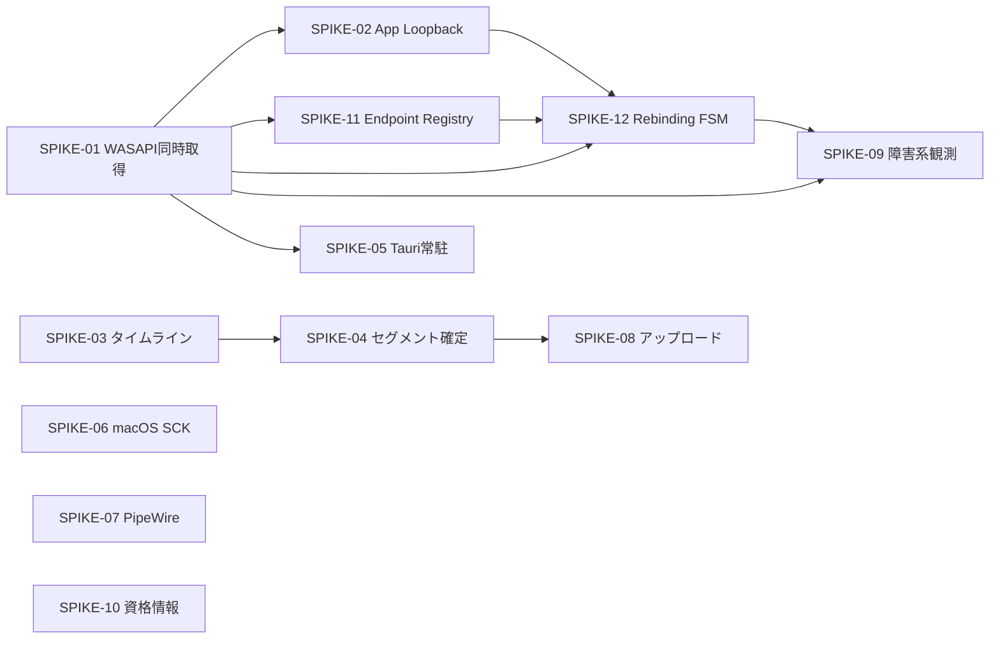

# 技術検証スパイク実施計画

* **文書ステータス**: Draft v0.2(2026-07-09 改定: §1.4 でスパイク継続 / 直接実装への区分を整理)
* **作成日**: 2026-07-06
* **対象設計書**: [design.md](design.md) — デスクトップ2トラック会議レコーダー Phase 1 設計書
* **目的**: 設計の前提のうち、実現性が本当に不確実なもの(§1.4 の A区分)だけを最小コストで検証し実現不可能な箇所を早期に発見する。実現性を疑う理由がないもの(B区分)は、検証プロセスを経ずに直接実装へ格上げする

---

## 1. スパイクの進め方

### 1.1 原則

* 各スパイクは **使い捨てコード** とする。プロダクションコードへの直接流用は前提にしない
* 各スパイクに **仮説・検証手順・合否基準・タイムボックス** を明記する
* タイムボックス超過時は「未検証のまま延長」ではなく、**結果を記録して判断会議へエスカレーション** する
* 成果物は `spikes/{spike-id}/` 配下にコードと `RESULT.md`(結果レポート)として残す

### 1.2 結果レポートのフォーマット

```markdown
# SPIKE-XX 結果
- 判定: GO / CONDITIONAL-GO / NO-GO
- 検証環境: OS バージョン、デバイス、会議アプリのバージョン
- 測定値: 合否基準に対する実測値
- 発見した制約・落とし穴
- 設計書への反映事項(修正が必要な節を明記)
```

### 1.3 優先順位の考え方

design.md の実装フェーズ(§21)は Windows 縦切り(Phase 1A)から始まるため、
**Windows キャプチャ系と共通タイムライン系を最優先(Wave 1)** とし、
macOS / Linux は方式の成立確認レベル(Wave 2)、周辺技術(Wave 3)の順で行う。

### 1.4 スパイクとして残すもの / 実装へ格上げするものの分類(2026-07-09 改定)

当初は SPIKE-01〜12 すべてを「使い捨てコードで検証し GO/NO-GO を判定してから本実装に入る」対象として扱っていた。しかし、WASAPI でのマイク/Endpoint Loopback 取得のように **Windows Core Audio の標準的な使い方の範囲内で、実現できることがほぼ確実な項目** まで、同じ重さの検証プロセス(使い捨てコード・タイムボックス・GO/NO-GO 判定・実機確認)に乗せる必要はない。以後、次の2区分で扱う。

**A区分: 本当に不確実で、先に単独で潰す価値がある(スパイクとして継続。§1.1/1.2 の原則をそのまま適用)**

| ID | 継続する理由 |
|---|---|
| SPIKE-02 | `ActivateAudioInterfaceAsync`(Process Loopback)を Rust の `windows` crate から呼べるかは前例が少なく、呼び出し可否そのものが不確実 |
| SPIKE-06 | macOS は新規プラットフォームで、ScreenCaptureKit の権限まわり・タイムスタンプ系が未検証 |
| SPIKE-07 | Linux も新規プラットフォームで、PipeWire の node 構造・ディストリ差異が未検証 |
| SPIKE-09 | 「Windows から実際にどんな通知・エラーが飛んでくるか」はドキュメントだけでは分からない実地観測が本質 |

**B区分: 実現性そのものは疑っておらず、直接実装へ格上げ(GO/NO-GO 判定なし、使い捨てコード前提も外す)**

| ID | 格上げする理由 |
|---|---|
| SPIKE-01 | WASAPI でのマイク/Endpoint Loopback 同時取得は標準的な Core Audio の使い方であり、実現性を疑う理由がない |
| SPIKE-03 | drift 補正アルゴリズムの正しさは OS API 非依存の疑似音源で検証でき、実装しながらテストを書けば足りる |
| SPIKE-04 | atomic commit 手順はファイルシステム操作であり、実装しながら故障注入テストを書けば足りる |
| SPIKE-05 | Tauri 2 の常駐は公式にサポートされている機能であり、実装しながら確認すれば足りる |
| SPIKE-08 | アップロードの冪等性はモックサーバで実装しながらテストを書けば足りる |
| SPIKE-10 | `keyring` crate の 3 OS round-trip は実装しながら確認すれば足りる |
| SPIKE-11 | `IMMNotificationClient` も Windows Core Audio の標準的な使い方であり、実現性を疑う理由がない |
| SPIKE-12 | Fake Worker での reducer 実装は純粋なロジックであり、実機なしで開発・テストできる |

**運用上の変更点**

* B区分の項目は、「SPIKE-XX」という識別番号はドキュメント上そのまま残すが、`spikes/{spike-id}/` 配下の使い捨てコードとしてではなく、そのままアプリ本体の実装として書き進めてよい。仮説・検証手順・合否基準は、実装時のセルフチェックリスト/テスト設計としてそのまま使う
* B区分について、**Windows 実機での動作確認(実際にマイク・スピーカーへ向けて実行する検証)は個別に行わず、開発がある程度進んだ段階でまとめて実施する**(現状は [windows-build-verification.md](windows-build-verification.md) の通り、Linux 上のクロスコンパイルでビルドが通ることの確認のみで先へ進める)
* A区分の項目のみ、引き続き §1.1(使い捨てコード原則)・§1.2(結果レポート)・タイムボックス超過時のエスカレーションを適用する
* §7(Go/No-Go 判断基準)は A区分のみを対象に整理し直した

---

## 2. スパイク一覧(サマリ)

| ID | テーマ | リスク | Wave | タイムボックス | 区分 |
|----|------|------|------|----------|------|
| SPIKE-01 | WASAPI マイク + Endpoint Loopback 同時取得とタイムスタンプ | 高 | 1 | — | B: 直接実装 |
| SPIKE-02 | Windows Application Loopback Capture(プロセス指定) | 高 | 1 | 3日 | A: スパイク |
| SPIKE-11 | Audio Endpoint Registry(全デバイスの観測状態追跡) | 高 | 1 | — | B: 直接実装 |
| SPIKE-12 | Capture Rebinding State Machine(再バインド時のepoch整合性) | 高 | 1 | — | B: 直接実装 |
| SPIKE-03 | 共通タイムライン整列・drift 補正アルゴリズム(疑似音源) | 高 | 1 | — | B: 直接実装 |
| SPIKE-04 | Opus 30秒セグメントの atomic commit とクラッシュ復旧 | 中 | 1 | — | B: 直接実装 |
| SPIKE-05 | Tauri 2 常駐(トレイ・ウィンドウ閉鎖時の録音継続) | 中 | 1 | — | B: 直接実装 |
| SPIKE-06 | macOS ScreenCaptureKit: system audio + microphone 同時取得 | 高 | 2 | 4日 | A: スパイク |
| SPIKE-07 | Linux PipeWire: playback node 取得と sink monitor フォールバック | 高 | 2 | 4日 | A: スパイク |
| SPIKE-08 | チャンクアップロード + Idempotency-Key による重複防止 | 中 | 2 | — | B: 直接実装 |
| SPIKE-09 | デバイス切断・スリープ復帰・Bluetooth プロファイル切替の挙動観測 | 中 | 3 | 3日 | A: スパイク |
| SPIKE-10 | OS 資格情報ストアへのトークン保存(3 OS) | 低 | 3 | — | B: 直接実装 |

合計目安: A区分(スパイクとして残るもの)のみで約 1.5〜2 人週。B区分はタイムボックスを設けず、通常の実装スケジュールの中で進める。

> **番号についての注記**: SPIKE-11/12 は本計画の後追いで追加したため、番号は末尾(11/12)だが **実施順は Wave 1、SPIKE-01/02 の直後** に置く。上表の並び順もその実施順を表しており、ID の昇順ではない。
>
> **区分についての注記(2026-07-09)**: 詳細は §1.4 を参照。B区分はスパイクとしての GO/NO-GO 判定・タイムボックスを設けず、直接実装として進める(以下の各節に残るタイムボックス・合否基準はセルフチェック用の参考値)。

---

## 3. Wave 1: Windows 縦切りの成立検証(Phase 1A の前提)

### SPIKE-01: WASAPI マイク + Endpoint Loopback 同時取得とタイムスタンプ

> **B区分(直接実装へ格上げ、2026-07-09)**: WASAPI でのマイク/Endpoint Loopback 同時取得は標準的な Core Audio の使い方であり、実現性そのものは疑っていない。GO/NO-GO 判定・タイムボックスは設けず、以下はそのままアプリ本体の実装として進める。以下の仮説・検証手順・合否基準は実装時のセルフチェック/テスト設計として使う。Windows 実機での動作確認は個別に行わず、開発がある程度進んだ段階でまとめて実施する(§1.4)。

**検証する仮説(design.md §5.1, §9.2)**

* Rust `windows` crate で WASAPI capture(マイク)と Endpoint Loopback を同一プロセス内で同時に安定取得できる
* 各フレームに対して `QueryPerformanceCounter` ベースの単調時刻(`host_time_ns`)を紐付けられ、`IAudioCaptureClient::GetBuffer` の `u64 QPCPosition` が実用精度で使える
* discontinuity フラグ(`AUDCLNT_BUFFERFLAGS_DATA_DISCONTINUITY`)を検出できる

**検証手順**

1. Rust コンソールアプリで 2 ストリームを開き、各コールバックの QPC 時刻・フレーム数・フラグを CSV へ記録
2. スピーカーからテスト音(880Hz)を再生しつつマイクへ 440Hz を入力し、10 分間録音
3. コールバック間隔のジッタ、バッファ欠落、タイムスタンプの単調性を分析
4. 生 PCM を WAV に落とし、2 トラックが取得できていることを聴感確認

**合否基準**

* 10 分間、両ストリームでサンプル欠落なし(または discontinuity として検出できる)
* QPC タイムスタンプが単調増加し、公称サンプルレートからの累積ずれが説明可能(drift として観測できる)
* CPU 使用率が実用範囲(目安: 1 コアの 10% 未満)

**タイムボックス**: 3日

---

### SPIKE-02: Application Loopback Capture(プロセス指定)

**検証する仮説(design.md §5.1)**

* `AUDIOCLIENT_ACTIVATION_TYPE_PROCESS_LOOPBACK` で指定プロセスツリーの音声のみを取得できる(Rust `windows` crate から呼べる)
* Zoom / Teams デスクトップ版のプロセスツリーを対象に、実際の会議音声を分離取得できる
* 対象プロセス再起動(PID 変化)を検出し、再アタッチできる

**検証手順**

1. C++ 公式サンプル(ApplicationLoopback)をまず動かし、挙動のベースラインを得る
2. 同等処理を Rust `windows` crate で移植する(ここが本丸。`ActivateAudioInterfaceAsync` の Rust からの呼び出しが最大の不確実点)
3. Zoom テスト会議に参加し、(a) Zoom 音声のみ取得されること、(b) 同時再生した YouTube 音声が混入しないことを確認
4. ブラウザ(Chrome)の Meet で同様に試し、他タブ音声の混入有無を記録する(混入する前提の設計だが、実態を把握する)
5. 会議アプリを再起動し、ストリームがどう振る舞うか(無音・エラー・停止)を観測

**合否基準**

* GO: Rust から Zoom/Teams のプロセス限定音声を取得でき、他アプリ音声が混入しない
* CONDITIONAL-GO: C++ サンプル経由(C++/Rust FFI)でのみ動作 → design.md §6.1 の「必要箇所のみ C++」の範囲を確定
* NO-GO 時の代替: Phase 1A/1B とも Endpoint Loopback のみとし、Application Loopback を Phase 2 へ繰り延べ

**タイムボックス**: 3日

**実装状況(2026-07-09)**: `spikes/spike-02-app-loopback`の実装は完了(`todo!()`は0件、`cargo build`/`--release`/`cargo test --no-run`いずれもエラー・警告なし)。`ActivateAudioInterfaceAsync`の呼び出し・PROPVARIANT(VT_BLOB)構築・`IActivateAudioInterfaceCompletionHandler`(`IAgileObject`実装込み)・GetMixFormat/固定フォーマットの2段階リトライまで実装済み。ただし**上記の検証手順・合否基準そのものはまだ何一つ満たされていない**。「Rustから呼べるか」という本スパイクの最大の不確実点は、Windows実機で実際に`Activate`を呼んで完了ハンドラが起動することを確認するまで未検証(cargo checkでの型検証と、実際の動作は別)。実機検証は開発が一定まとまった段階でまとめて行う方針(windows-build-verification.md参照)。

---

### SPIKE-11: Audio Endpoint Registry(全デバイスの観測状態追跡)

> **B区分(直接実装へ格上げ、2026-07-09)**: `IMMNotificationClient` も Windows Core Audio の標準的な使い方であり、実現性そのものは疑っていない。GO/NO-GO 判定・タイムボックスは設けず、直接実装として進める(§1.4)。

**実装詳細**: 本節の仮説・検証手順をコーディング着手可能な粒度まで詳細化したものが [spike-windows-11-detail-design.md](spike-windows-11-detail-design.md) にある(`IMMNotificationClient`の`#[implement]`実装、登録/解除、初期スナップショット構築、`EndpointOsEvent`型定義、消費スレッドでの`AudioEvent`変換)。

**検証する仮説(design.md §16.5, §10 セッション状態モデルの前提)**

* `IMMNotificationClient` により、マイク・スピーカー全体の追加/削除/状態変化/プロパティ変化/既定デバイス変更を endpoint ID 単位で追跡できる
* callback はイベントを queue へ積むだけに留め、重い処理(再列挙、COM オブジェクトの解放)は別スレッドへ逃がす構造にできる
* 既定デバイスが存在しない状態(NULL)を `Option<EndpointId>` として正しく表現できる
* この登録・追跡は、列挙されたデバイスごとに個別の状態機械を持たなくても(スナップショットの保持のみで)成立する

**検証手順**

1. 起動時に全 endpoint(capture / render)を列挙し、endpoint ID をキーにした `EndpointSnapshot` レジストリを構築する
2. `IMMNotificationClient` を登録し、callback は `EndpointOsEvent`(`DeviceAdded` / `DeviceRemoved` / `DeviceStateChanged` / `PropertyChanged` / `DefaultChanged`)を queue へ push するだけの実装にする
3. 管理スレッド側で queue を消費し、対象 ID を再取得してレジストリを更新、変更前後を JSONL(`seq` / `event` / `endpoint_id` / `flow` / `old_state` / `new_state` / `observed_at_100ns`)へ記録する
4. 次の操作を行い、記録された JSONL とレジストリの最終状態を確認する: USB マイク/ヘッドセットの抜き差し、Windows 設定でのマイク/スピーカーの無効化・有効化、既定マイク・既定スピーカー・通信用既定デバイスの変更、デバイス名変更、マイク mute 変更、スピーカー mute/音量変更、Bluetooth 接続・切断

**合否基準**

* すべての変化が endpoint ID 単位で JSONL に記録される
* callback 内で再列挙や COM 解放などの重い処理を行っていない(callback 所要時間を計測し、ブロッキングが起きていないことを確認)
* 再列挙後のレジストリが Windows の実状態(サウンド設定・コントロールパネル)と一致する
* 既定デバイスなしの状態を表現でき、異常終了しない
* 同一 endpoint が重複登録されない、削除済み endpoint の callback 登録が残らない、終了時にすべて Unregister される(ハンドル/登録のリークがない)

**タイムボックス**: 3日

---

### SPIKE-12: Capture Rebinding State Machine(再バインド時の epoch 整合性)

> **B区分(直接実装へ格上げ、2026-07-09)**: Fake Worker での reducer 実装は純粋なロジックであり、実機なしで開発・テストできる。GO/NO-GO 判定・タイムボックスは設けず、直接実装として進める(§1.4)。ただし検証手順4(実 WASAPI ワーカーへの差し替え)のみは、実機でのまとめ検証(§1.4)のタイミングで行う。

**検証する仮説(design.md §16.5 のデバイス binding mode、SPIKE-01/02 の `capture_epoch` の一般化)**

* `Idle → Resolving → Activating → Capturing → Interrupted → Rebinding / WaitingForDevice → Capturing` という共通の FSM で、マイク capture・Endpoint Loopback・Process Loopback の 3 種類のキャプチャソースを扱える
* design.md §16.5 の binding mode(`Fixed selected device` = Pinned / `Follow system default` = FollowDefault)を、既定デバイス変更時の挙動として明確に分離できる
* 再バインド前後で、SPIKE-01/02 の `capture_epoch` を全ストリーム共通の `stream_epoch` として一般化しても、旧世代と新世代のフレームを混在させずに扱える
* Process Loopback は対象 endpoint の状態変化(既定スピーカー変更など)では再起動すべきでなく、対象プロセスの終了/再起動と Audio Service 側の切断のみを再バインド対象にできる

**検証手順**

1. SPIKE-11 のレジストリ更新イベントを入力として、実 WASAPI を呼ばない Fake Worker で `CaptureBinding` の FSM と reducer(`reduce(state, event) -> effects`)を実装する
2. 次の 4 シナリオをイベント列テストとして自動化する: (a) FollowDefault マイクでの既定変更(A→B)で A 停止完了後に B へ接続すること、(b) Pinned マイクの切断で `WaitingForDevice` へ遷移し既定デバイスへ自動フォールバックしないこと・再接続で復帰すること、(c) FollowDefault スピーカー Loopback での既定変更で旧 stream 停止→新 endpoint で再開すること、(d) Process Loopback で既定スピーカー変更/対象アプリの出力先変更では継続し、対象アプリ再起動時のみ PID 再探索・epoch 更新が起きること
3. `operation_id` / `stream_epoch` の不一致による stale event の棄却、Stop 完了前に新規 Start を発行しない、といった不変条件を property test で検証する
4. Fake Worker を実 WASAPI ワーカーへ差し替え、SPIKE-01/02/09 の環境で同シナリオを実機実行し、`RecoveryTiming`(障害検出時刻・旧 stream 停止時刻・新 stream Activate 時刻・最初の新 PCM 到着時刻)を計測する

**合否基準**

* 旧 epoch のフレームが新 epoch 開始後に出力されない(全フレームに `endpoint_id` と `stream_epoch` が記録され、境界で混線が起きない)
* FollowDefault と Pinned とで、既定デバイス変更時の挙動が design.md §16.5 の binding mode どおりに異なる
* Pinned デバイス切断時に `WaitingForDevice` へ遷移し、別デバイスへ勝手にフォールバックしない。再接続時に復帰する
* Process Loopback が endpoint 側の変更だけでは不要に再起動しないことを実機(Zoom/Teams)で確認できる
* 復旧不能時に無限リトライしない、callback スレッド内で stop/join/Activate を行わない
* `AUDCLNT_E_DEVICE_INVALIDATED` と session disconnect の理由(`IAudioSessionEvents::OnSessionDisconnected`)を記録できる

**タイムボックス**: 4日

**設計の全体像**: SPIKE-11/12 が検証する三層モデル(endpoint観測状態・選択ポリシー・録音bindingのFSM)、および Observation → Admission → Decision → Effect Execution への発展形は、[audio-device-state-architecture.md](audio-device-state-architecture.md) に設計書として整理してある。Fake Worker 実装(検証手順1〜3)はこの設計書の型定義・reducer をそのまま出発点にできる。

**備考**: SPIKE-09(デバイス変更・スリープ・Bluetooth の挙動観測)とは役割が異なる。SPIKE-09 は「Windows から実際にどんな通知・エラーが飛んでくるか」の実地観測であり、SPIKE-11/12 は「観測したイベントを状態機械としてどう安全に処理するか」の検証にあたる。SPIKE-12 の FSM とハーネスは SPIKE-09 の実機シナリオでそのまま利用できるため、SPIKE-09 の実施前に完了しておくのが望ましい(実際にはSPIKE-09を先に実装したため、今回SPIKE-12は後追いで整合させる形になった)。

* `CaptureBindingState`(`Stopped`/`Resolving`/`Starting`/`Running`/`Stopping`/`Waiting`/`Failed`)と`decide(state, input) -> Vec<Effect>`をaudio-device-state-architecture.md §6.4の型定義どおりに実装。`decide`は時刻取得・乱数・I/O・スレッド生成を一切行わない純粋関数
* 検証手順2の4シナリオ(a〜d)をすべて`tests/scenarios.rs`にイベント列テストとして実装し、**全7テストがpass**(4シナリオ + stale event拒否 + 無限リトライ防止 + shutdown後Start抑止)
* 検証手順3の不変条件(stale operation_id/epochの棄却、Stopping中に新規Startを発行しない、Pinnedが別endpointへフォールバックしない)もテストで確認済み
* 実装中に**実際のバグを2件発見・修正**: (1) `start_binding`が`Stopped`状態からしか開始を許可しておらず、`Waiting`(デバイス復帰・リトライタイマー)からの再開始が常に無視されていた、(2) 連続失敗回数を`Waiting`状態の中だけに持たせていたため、`Starting`へ一度でも遷移すると回数が失われ、`MAX_RETRY_ATTEMPTS`に決して到達しない(実質無限リトライになる)実装になっていた。後者は`CaptureBinding`に`retry_attempt`フィールドを追加し、lifecycle enumを跨いで保持する形に直して解消した
* 検証手順4(実WASAPIワーカーへの差し替え)は未着手。SPIKE-01/02/09で実装済みの`spike_common::capture_loop`/`device_watch`をFake Worker側の型(`Observation`/`Effect`)へ変換するアダプタ層が必要で、実機での`RecoveryTiming`計測とあわせて、開発がまとまった段階でのWindows実機検証時に行う

**実装状況(2026-07-09)**: `spikes/spike-12-rebinding-fsm`として実装済み。**windowsクレートに一切依存しない純粋なRustクレート**のため、このLinux環境で実装からテスト実行まで完結できた(SPIKE-01/02と違いクロスコンパイルの型検証止まりではなく、実際に`cargo test`が通ることまで確認済み)。

---

### SPIKE-03: 共通タイムライン整列・drift 補正(疑似音源)

> **B区分(直接実装へ格上げ、2026-07-09)**: OS API 非依存の疑似音源で検証できるロジックであり、実装しながらテストを書けば足りる。GO/NO-GO 判定・タイムボックスは設けない(§1.4)。

**検証する仮説(design.md §11, §19.2)**

* 異なるサンプルレート・異なるコールバック周期・意図的 clock drift を持つ 2 疑似音源を、20ms スロットの共通タイムラインへ整列できる
* resampler 比率の緩やかな調整で、聴感上の歪みなく drift を吸収できる
* 2 時間相当のシミュレーションで同期差 100ms 以内(§3.2 の品質ゴール)を達成できる

**検証手順**

1. OS API 非依存の疑似キャプチャ(440Hz / 880Hz、+50ppm / −50ppm の drift、ランダム packet loss、discontinuity)を実装
2. タイムライン整列 + silence 補完 + drift 補正のプロトタイプを Rust で実装(rubato 等の resampler crate を評価)
3. 2 時間分を高速実行し、出力 2 トラックの長さ一致・位相ずれを自動計測
4. drift 補正の有無での同期差を比較し、補正パラメータ(比率上限・観測窓)の目安を得る

**合否基準**

* 2 時間相当で両トラック長が完全一致、相互相関による同期差測定で 100ms 以内(目標 20ms 以内)
* packet loss / discontinuity 混入時もセグメント境界が壊れない
* 20ms フレーム処理がリアルタイムの 10 倍速以上で回る(CPU 余裕の確認)

**タイムボックス**: 4日

**備考**: このスパイクの成果はテストハーネス(§19.2)としてほぼそのまま再利用価値があるため、例外的に品質高めに書いてよい。

---

### SPIKE-04: Opus セグメントの atomic commit とクラッシュ復旧

> **B区分(直接実装へ格上げ、2026-07-09)**: atomic commit 手順はファイルシステム操作であり、実装しながら故障注入テストを書けば足りる。GO/NO-GO 判定・タイムボックスは設けない(§1.4)。

**検証する仮説(design.md §11.1, §12.2)**

* Rust から Opus(Ogg コンテナ、48kHz mono)で 30 秒セグメントをエンコードできる(`opus` / `ogg` crate、または audiopus)
* 「.partial 書き込み → flush → fsync → SHA-256 → atomic rename → SQLite 登録」の手順が Windows(NTFS)で期待どおり動く
* 各段階での強制 kill 後、再起動スキャンで孤立ファイルを正しく分類・復旧できる

**検証手順**

1. 疑似 PCM を 30 秒ごとに Opus セグメント化して書き出すループを実装
2. 書き込みシーケンスの各ステップ(partial 書き込み中 / fsync 前 / rename 前 / DB 登録前)で `taskkill /F` する自動テストを作成
3. 再起動スキャンが「破棄すべき partial」「DB 未登録の完成ファイル」を正しく処理することを確認
4. セグメントサイズを実測し、ビットレート設定(例: 32kbps)での 2 時間分の容量を見積もる

**合否基準**

* どのタイミングで kill しても、確定済みセグメントが破損しない・失われない
* 未確定損失が 30 秒 + エンコーダバッファ以内(§3.2)
* Ogg/Opus ファイルが ffprobe / 一般プレイヤーで正常に再生できる

**タイムボックス**: 2日

**設計の全体像**: 本スパイクが検証する「atomic commit + クラッシュ復旧」は、[audio-device-state-architecture.md](audio-device-state-architecture.md) §7(Effectの完了保証と冪等性)で一般化した Durable Effect Ledger モデルの具体例にあたる。特に §7.4.3(設定・JSON・summaryの保存)・§7.6〜7.8(録音保存プロトコル・append再送・WAV遅延生成)は、本スパイクの検証手順・合否基準をそのまま拡張できる設計になっている。

---

### SPIKE-05: Tauri 2 常駐と録音ライフサイクル分離

> **B区分(直接実装へ格上げ、2026-07-09)**: Tauri 2 の常駐は公式にサポートされている機能であり、実装しながら確認すれば足りる。GO/NO-GO 判定・タイムボックスは設けない(§1.4)。

**検証する仮説(design.md §6, §14)**

* Tauri 2 でウィンドウを閉じてもトレイ常駐でバックエンド(録音スレッド)が継続する
* Rust 側の状態(レベルメーター値、録音時間)を UI へ低負荷でストリーミングできる(イベント emit の頻度・負荷)
* WebView の再オープン時に状態を復元表示できる

**検証手順**

1. Tauri 2 + Vue 3 の雛形に、SPIKE-01 のキャプチャ(またはダミー音源)を組み込む
2. トレイアイコン・録音中インジケータ・ウィンドウ閉鎖→再表示を実装
3. レベルメーター更新(30fps 想定)を 1 時間流し、UI 側・Rust 側のメモリと CPU を観測
4. Windows でのウィンドウ閉鎖時のプロセス生存、OS 再起動時の挙動を確認

**合否基準**

* ウィンドウ閉鎖後も録音(音声取得+書き込み)が途切れない
* 1 時間の常駐でメモリリークの兆候がない(RSS が安定)
* レベルメーター更新でフレーム落ち・IPC 詰まりが起きない

**タイムボックス**: 2日

**実行検証は本環境ではブロックされている**: このコンテナ内でWebKitGTKのWebView初期化がハングし、ビルド済みバイナリを実行してのソークテスト(RSSサンプリング、SIGUSR1によるhide/show模擬)が行えないことを確認した。原因はvirtio-gpu仮想GPUにMesaドライバがbindされていないこと(`libEGL warning: pci id for fd ...: 1b36:0100, driver (null)`)で、`WEBKIT_DISABLE_SANDBOX_THIS_IS_DANGEROUS`/`WEBKIT_DISABLE_COMPOSITING_MODE`/`WEBKIT_DISABLE_DMABUF_RENDERER`/`LIBGL_ALWAYS_SOFTWARE`/`GALLIUM_DRIVER=llvmpipe`/`GDK_GL=disable`等の組み合わせを試したが解消しなかった。**この問題が本スパイクのRustコードに起因しないことは、webkit2gtk本体付属の`MiniBrowser`(Tauri/wryを一切介さない)でも同一環境下で`about:blank`の表示すら同様にハングすることを確認して切り分け済み**(素のGTK3ウィンドウ(`gtk` crateで自作した最小テスト)は同じXvfb環境で問題なく動作したため、GTK自体ではなくWebKitGTKのGPU初期化に問題が限局されている)。ソークテスト用スクリプト(`spikes/spike-05-tauri-tray/soak_test.sh`)は実行可能な状態で用意してあるので、実GPUまたは3Dアクセラレーション付きの環境が手に入り次第そのまま使える。SPIKE-06/07(実機が必要)と同様、本スパイクも「実装は完了しているが実行検証にはこの環境にない何か(実GPU/実ディスプレイ)が要る」という位置づけになった。

---

## 4. Wave 2: macOS / Linux の方式成立確認とアップロード

### SPIKE-06: macOS ScreenCaptureKit の audio + microphone 同時取得

**検証する仮説(design.md §5.2)**

* macOS 15 で同一 `SCStream` から `SCStreamOutputType.audio`(system audio)と `.microphone` を同時取得できる
* `SCContentFilter` でアプリ単位(Zoom.app 等)の音声に限定できる
* 両出力の `CMSampleBuffer` タイムスタンプを共通のホスト単調時刻(mach absolute time 系)へ変換して整列に使える
* Swift → C ABI → Rust のブリッジで PCM とタイムスタンプを受け渡せる

**検証手順**

1. Swift 単体のコマンドラインツールで SCStream を構成し、権限プロンプト(Microphone / Screen & System Audio Recording)の発火と拒否時の挙動を確認
2. Zoom を対象にした SCContentFilter で会議音声を取得し、他アプリ音声(Music.app 再生)が混入しないことを確認
3. audio / microphone 両出力のタイムスタンプの時刻系を特定し、換算式を検証
4. C ABI 経由で Rust 側へフレームを渡す最小ブリッジを作り、スループットとコピーコストを測定
5. 権限取消(録音中に System Settings で OFF)時のエラー通知のされ方を観測

**合否基準**

* system audio と microphone が別ストリームとして取得でき、アプリフィルタが機能する
* 両者のタイムスタンプ差から相対整列が可能(SPIKE-03 のタイムラインへ載せられる)
* 権限拒否・取消を検出してエラーとして扱える(サイレント無音にならない、なる場合は検出策を確立)

**タイムボックス**: 4日

**備考**: 開発には macOS 15 実機と Apple Developer 署名が必要。未署名時の TCC 挙動の差異も記録する。

---

### SPIKE-07: Linux PipeWire の playback node 取得と monitor フォールバック

**検証する仮説(design.md §5.3)**

* pipewire-rs で registry を列挙し、アプリの playback stream node を識別できる(Zoom / Chrome の node 名・プロパティの実態確認)
* 特定アプリの playback node を直接キャプチャできる、または `stream.capture.sink` で sink monitor を取得できる
* node の消失・再生成(アプリ再起動)を registry イベントで検出できる

**検証手順**

1. Ubuntu 24.04(Wayland / PipeWire)で `pw-dump` により Zoom・Chrome(Meet)の node 構造とプロパティを調査
2. pipewire-rs でマイク source capture と sink monitor capture を同時実行し、タイムスタンプ取得方法(`pw_time`)を確認
3. 特定アプリ node に接続するキャプチャを試み、可否と制約(接続タイミング、node 出現前の扱い)を記録
4. 会議アプリ再起動 → node 再生成 → 再接続の流れを実装して観測
5. 同一手順を Fedora でも実行し、差異を記録。加えて Flatpak 版 Chrome で portal 制約の有無を確認

**合否基準**

* GO: アプリ単位の playback node キャプチャ + monitor フォールバックの両方が成立
* CONDITIONAL-GO: monitor フォールバックのみ成立 → §5.3 の選択方針を「monitor 主・node 直結は best effort」へ修正
* node 消失検出から silence 挿入への繋ぎに必要なイベントが取得できる

**タイムボックス**: 4日

---

### SPIKE-08: チャンクアップロードと Idempotency-Key

> **B区分(直接実装へ格上げ、2026-07-09)**: アップロードの冪等性はモックサーバで実装しながらテストを書けば足りる。GO/NO-GO 判定・タイムボックスは設けない(§1.4)。

**検証する仮説(design.md §13)**

* `UploadAdapter` trait の契約(create → segment PUT → finalize)で、順序不定・重複送信・途中再開を安全に扱える
* Idempotency-Key(`{session_id}:{track}:{sequence}`)+ Content-SHA256 でサーバ側重複排除が成立する

**検証手順**

1. 推奨 API 契約(§13.1)を実装したモックサーバ(Rust axum 等)を作成。ランダムに 5xx / 429 / timeout / 「受領済みなのに応答喪失」を注入する
2. reqwest + exponential backoff + jitter の Upload Worker プロトタイプを実装
3. 100 セグメントのセッションを、故障注入率 30% で完走させ、サーバ側の登録がちょうど 100 件であることを確認
4. アップロード途中でクライアントを kill → 再起動 → SQLite の状態から再開できることを確認

**合否基準**

* 故障注入下でも重複登録 0 件・欠落 0 件で finalize まで到達
* 再起動後の再開で二重送信が発生しても API 上は冪等に処理される

**タイムボックス**: 2日

* `UploadAdapter`契約(create→segment PUT→finalize)をaxumモックサーバ+reqwestクライアント+rusqlite(bundled、実際のSQLite)で実装
* モックサーバは`Idempotency-Key`到達時点でキャッシュ済み応答があれば本体ロジックへ到達させず即座に返す(design.md §13.3「APIが受領済みの場合は成功扱い」)。故障注入は「本体処理前に弾く」「本体処理(書き込み)は成功させたうえで応答だけ握りつぶす(受領済みなのに応答喪失)」「タイムアウトを誘発する疑似スリープ」の3種を用意し、後者2つが冪等性の本質的なテストになる
* クライアントはdesign.md §13.3の再送規則(timeout/5xx/429は再送、401はトークン更新後1回だけ再送、4xx恒久エラーは即停止)どおりに分類し、exponential backoff + jitterで再送する
* 検証手順3: 100セグメントを8並列・故障率合計30%(pre 10% + post 10% + timeout 10%)で完走させ、**サーバ側の実書き込み回数がちょうど100件、かつ全セグメントで書き込み回数が1回であること(重複登録0件)を確認**
* 検証手順4: 100セグメントをSQLiteスプールへ積み、39個目まで正常アップロード、40個目(index=39)は「サーバへの送信は成功したがローカルDBへuploaded=1を書く前にプロセスが死んだ」状態を再現してそこで打ち切り、新しい`SpoolDb`ハンドルで再接続(プロセス再起動相当)して残り61件(39個目の再送を含む)を再開。**39個目はクライアント視点で2回送信されるが、サーバ側の実書き込みは1回のみであることを確認**(Idempotency-Keyが`{session_id}:{track}:{sequence}`から決定的に導出されるため、再送でも同じキーになることが前提)
* 合否基準の両方(重複登録0件・欠落0件でfinalize到達/再起動後の再開が冪等)を`cargo test`で自動化し、いずれもpass

---

## 5. Wave 3: 障害系と周辺技術

### SPIKE-09: デバイス変更・スリープ・Bluetooth の挙動観測(Windows 中心)

**検証する仮説(design.md §16, §23)**

* マイク切断・既定デバイス変更・スリープ復帰・Bluetooth の A2DP↔HFP プロファイル切替を、WASAPI のイベント/エラーとして検出できる
* format change(サンプルレート変更)を検出して再初期化できる

**検証手順**

1. SPIKE-01 のハーネスへイベントログを追加し、次の操作を実施して観測結果を表にまとめる:
   USB マイク抜去 → 再接続 / 既定出力デバイス切替 / スリープ → 復帰 / BT ヘッドセットでマイク使用開始(HFP 切替)
2. 各イベントで (a) 何のエラー・通知が来るか、(b) ストリームは自動復帰するか、(c) タイムスタンプは連続するか、を記録
3. 検出 → silence 挿入 → 再初期化の最小実装で録音が継続できることを確認

**合否基準**

* すべての障害イベントが「検出可能」に分類できる(検出不能なサイレント無音が存在しない、または回避策がある)
* 障害を跨いでもタイムラインが破綻しない(SPIKE-03 の整列器が silence で埋めて長さ一致を保つ)

**タイムボックス**: 3日

ただし、これは「観測・復帰の仕組みを実装した」だけであり、**検証手順2・合否基準そのものは実機でのUSBマイク抜き差し・既定デバイス切替・スリープ・BT切替を実際に行うまで未検証**。実機検証は開発が一定まとまった段階でまとめて行う方針(windows-build-verification.md参照)。silence挿入自体はSPIKE-03の責務のため、今回の実装はイベント記録とストリーム再アタッチのみに留めている。

**実装状況(2026-07-09)**: 検証手順1(SPIKE-01のハーネスへイベントログを追加)は実装済み。`spike-common::device_watch`(`IMMNotificationClient`実装、`IAgileObject`込み)でデバイス追加/削除/状態変化/既定デバイス変更/プロパティ変更を`device_events.jsonl`へ記録し、`spike-common::capture_loop`で`IAudioSessionEvents::OnSessionDisconnected`の観測と`AUDCLNT_E_DEVICE_INVALIDATED`検出→`CaptureExit::DeviceLost`への変換を実装。検証手順3(検出→再初期化の最小実装)も、SPIKE-01の`main.rs`に`StreamSupervisor`として実装済み(デバイス消失検出後、同じ`device_id_or_default`で再解決・再初期化を試みる。上限は`--max-recovery-attempts`、既定10)。

---

### SPIKE-10: OS 資格情報ストアへのトークン保存

> **B区分(直接実装へ格上げ、2026-07-09)**: `keyring` crate の 3 OS round-trip は実装しながら確認すれば足りる。GO/NO-GO 判定・タイムボックスは設けない(§1.4)。

**検証する仮説(design.md §12.4)**

* `keyring` crate(または同等)で Windows Credential Manager / macOS Keychain / Linux Secret Service へトークンを保存・取得できる
* Linux でヘッドレス・Secret Service 不在環境(最小構成デスクトップ)のフォールバック方針を決められる

**検証手順**

1. 3 OS で save / load / delete の round-trip を確認
2. Linux で gnome-keyring 不在時のエラーを観測し、フォールバック(拒否 or 暗号化ファイル)の判断材料を得る

**合否基準**: 3 OS の標準デスクトップ環境で round-trip 成功。Linux 例外系の方針が決まる

**タイムボックス**: 1日

* `keyring` crate(v2)でOS資格情報ストアへの保存を試みたところ、実際に次のエラーを観測した: `Platform secure storage failure: zbus error: org.freedesktop.DBus.Error.ServiceUnknown: The name org.freedesktop.secrets was not provided by any .service files`。これは「Secret Serviceデーモンが起動していない」ことを示す典型的なエラーであり、検証手順2の「エラーを観測」がそのまま実測できた
* 上記のエラー文字列を判定条件として、暗号化ファイル(AES-256-GCM、マスターキーはファイル権限0600で保護)へフォールバックする`FallbackCredentialStore`を実装。フォールバックは「バックエンドが存在しない」ことを示すエラーだけに絞り、認証拒否やロック中などその他のエラーでは低強度の保護へ意図せず落ちないようにした
* save/load/delete のround-tripを暗号化ファイルストアで実施し、**プロセス再起動を模した(新しいインスタンスで同じディレクトリを開き直す)テストでもマスターキーの永続化・復号が成功することを確認**。フォールバック込みのエンドツーエンドテストも含め全4テストがpass
* Windows Credential Manager / macOS Keychainでのround-tripはこの環境では検証不可(実機が必要)。ただし`keyring` crateが3 OSを同じAPIで抽象化する設計のため、Linux側で発見した「バックエンド不在時のエラー分類とフォールバック方針」というLinux固有の課題は解決済みで、残るリスクはWindows/macOS側の実機round-tripの確認のみ

---

## 6. スケジュールと依存関係



* **B区分(SPIKE-01/03/04/05/08/10/11/12)にはゲートがない**。上の依存関係は「どちらを先に実装すると手戻りが少ないか」という実装順の目安であり、GO/NO-GO 判断のための待ち合わせ点ではない
* SPIKE-01 と SPIKE-03 は独立しており、**2 名いれば初日から並行して実装可能**(1 名なら 01 → 03 の順)
* SPIKE-11 は Windows Core Audio のデバイス列挙 API のみに依存するため、SPIKE-01 と並行着手できる。SPIKE-12 は Fake Worker で FSM 自体を先に作れるため SPIKE-01/02 の完了を待たずに設計・実装を始められるが、実 WASAPI ワーカーへの差し替え(検証手順4)は実機でのまとめ検証(§1.4)のタイミングで行う
* **A区分(SPIKE-02/06/07/09)のみ、引き続き GO/NO-GO 判断の対象**。SPIKE-06 / 07 は Wave 1 と独立のため、環境(macOS 15 実機、Ubuntu 24.04 実機)さえあれば前倒し可能
* **Phase 1A の実装着手そのものにゲートはない**。design.md のレビューが完了し次第、B区分の実装(SPIKE-01/03/04/05/11/12 相当)に着手する。並行して SPIKE-02(Application Loopback)の可否を検証し、結果に応じて §5.1 / §20.2 の対応範囲を確定する
* SPIKE-11/12 を先に実装してから SPIKE-03(共通タイムライン)へ進むことで、後から録音基盤(epoch 境界の扱い)を作り直すリスクを下げる、という順序自体は変わらない
* macOS(Phase 1C)/ Linux(Phase 1D)の計画確定は SPIKE-06 / 07 の結果を待つ

---

## 7. Go/No-Go 判断基準(A区分のみ)

**2026-07-09 改定**: §1.4 の区分に伴い、この表は A区分(SPIKE-02/06/07/09)のみを対象にする。B区分(SPIKE-01/03/04/05/08/10/11/12)は GO/NO-GO 判断を設けず、実装と受け入れ条件(design.md §20)のテストで確認する。Phase 1A の実装着手自体にゲートはない(§6)。

| 判断ポイント | GO 条件 | NO-GO 時のアクション |
|---|---|---|
| Application Loopback 採用 | SPIKE-02 が GO または CONDITIONAL-GO | Endpoint Loopback のみで Phase 1B を再定義し、§5.1 / §20.2 を修正 |
| macOS を Phase 1C で実施 | SPIKE-06 が GO | macOS 対応時期の再計画、または CoreAudio tap 等の代替方式スパイクを追加 |
| Linux を Phase 1D で実施 | SPIKE-07 が GO または CONDITIONAL-GO | 対応ディストリの絞り込み、または monitor 専用へ §5.3 を縮退 |
| デバイス変更時の障害復旧方針 | SPIKE-09 で、すべての障害イベントが「検出可能」に分類できる | 検出不能なサイレント無音が残る箇所を design.md §16 に既知の制約として明記し、リリース前に再検証 |

**B区分の妥当性は次のテストで確認する(GO/NO-GO 判断ではなく実装の受け入れ条件として)**

| 確認事項 | 確認方法 |
|---|---|
| 品質ゴール(同期 100ms、design.md §3.2) | SPIKE-03 相当の疑似音源シミュレーション(2時間相当)を自動テスト化し、CI で継続的に確認する |
| デバイス自動再バインド(design.md §16.5) | SPIKE-12 相当のイベント列テスト・property test がすべて通過することを確認する。Phase 1 では `Fixed selected device` を既定とし、`Follow system default` は §16.5 のとおり実験的設定に留める方針自体は変えない |
| Tauri 常駐(SPIKE-05 相当) | 実装後、1 時間の常駐でメモリリークがないことを開発中に確認する |

---

## 8. 準備物チェックリスト

* [ ] Windows 11 実機(build 20348 以降 — Application Loopback 要件)
* [ ] macOS 15 実機 + Apple Developer アカウント(署名・TCC 検証用)
* [ ] Ubuntu 24.04(Wayland / PipeWire)実機または VM(音声パススルー可能なもの)
* [ ] Fedora Workstation 環境
* [ ] USB マイク、Bluetooth ヘッドセット(HFP/A2DP 切替検証用)
* [ ] Zoom / Teams / Chrome(Meet)のテスト用アカウントとテスト会議
* [ ] 検証結果を置くリポジトリ `spikes/` ディレクトリと RESULT.md テンプレート

SPIKE-11/12 は上記の USB マイク・Bluetooth ヘッドセット・Windows 11 実機のみで検証可能であり、追加の準備物は不要。

**B区分(SPIKE-01/03/04/05/08/10/11/12)は、上記の実機がなくてもLinux上のクロスコンパイル(`x86_64-pc-windows-gnu` ターゲット)でビルド確認しながら実装を進められる**([windows-build-verification.md](windows-build-verification.md) 参照)。実際にマイク・スピーカーへ向けて実行する動作確認は、A区分スパイク(SPIKE-02/09)の実施タイミング、または開発がまとまった段階でのバルク検証時にあわせて行う。

---

## 9. 検討中の追加候補(未着手)

design.md・本計画・audio-device-state-architecture.md を通読した結果、既存の SPIKE-01〜12 のどれとも重複しない、かつ技術的に掘る価値があると判断した候補を記録する。優先度・タイムボックス・検証手順は未確定であり、着手する場合は改めて仮説・検証手順・合否基準を詰めてから ID(SPIKE-13〜)を割り当てる。

| 候補 | 技術的な論点 | 既存スパイクとの関係 |
|---|---|---|
| SQLite(session-store)の並行アクセス・クラッシュ安全性 | WAL モードでの複数スレッド同時書き込み、Windows NTFS 上での busy-timeout 挙動、強制終了時の DB 破損可能性。design.md §7/§12 の Segment Writer・Upload Worker・Session Orchestrator が同一 DB へ書き込む構成の中核部分 | SPIKE-04(Opus ファイルの原子性)とは対象が異なり、どのスパイクにも含まれていない |
| Modern Standby(S0ix)と classic sleep(S3)の違い | Windows 11 の新しいラップトップの多くは Modern Standby がデフォルト。ネットワーク・一部プロセスを制限付きで動かし続けるなど classic sleep と挙動が大きく異なり、「録音中は必ず継続する」(design.md §3.2)に直結する | SPIKE-09(スリープ→復帰)の検証手順を明示的に拡張すれば足りる可能性が高い |
| 企業ネットワーク環境でのアップロード(プロキシ認証・TLS インスペクション) | NTLM/Kerberos プロキシ認証、企業の TLS インスペクション(独自ルート CA)下での挙動 | SPIKE-08 はモックサーバでの故障注入(5xx/429/timeout)のみを対象としており、実際の企業ネットワーク条件は未検証 |
| Windows Credential Manager の実運用制限 | Generic Credential のサイズ上限(概ね 2.5KB 程度)、企業のローミングプロファイル・グループポリシーによる資格情報ストアへのアクセス制限 | SPIKE-10 は 3 OS での round-trip 確認に留まる |
| WebView2 ランタイムの企業環境での可用性 | Tauri が内部で依存する WebView2 の自動更新(Evergreen)が、企業管理された Windows 機ではグループポリシーで無効化・特定バージョン固定されている場合がある | SPIKE-05 は「WebView2 が動く前提」でトレイ常駐のみを検証しており、WebView2 自体の可用性は対象外 |
| コード署名なしバイナリに対する SmartScreen/AV(EDR)の反応 | WASAPI ループバック取得・プロセス列挙・資格情報保存の組み合わせは、行動ベースの AV/EDR から見て「スパイウェア的挙動」に見えやすい。VirusTotal へのアップロード等の軽量確認で早期に実態を把握できる | 技術検証というより配布可否に関わるリスクだが、実装が進んでから気づくと手戻りが大きい |

優先度の目安(技術的な深掘り価値・design.md への影響度から): SQLite並行性 > Modern Standby > 企業ネットワーク環境 > WebView2可用性 > Credential Manager制限・SmartScreen/AV反応。
